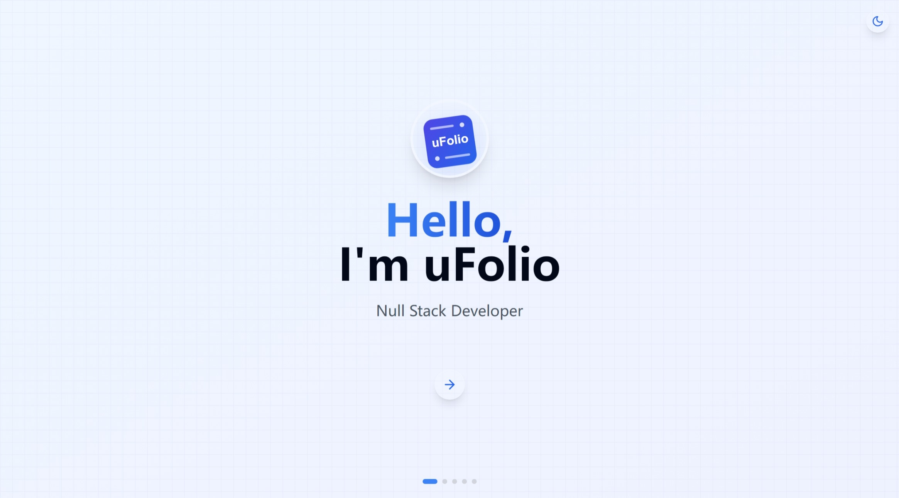
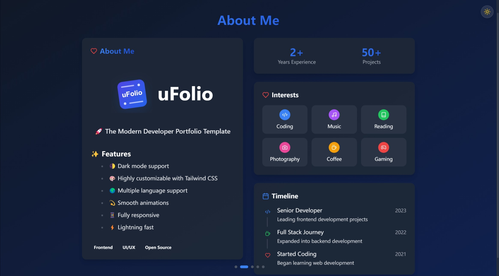

<div align="center">   
<p align="center" style="font-family: 'Segoe UI', Helvetica, Arial, sans-serif; font-weight: 600;">  
  <a href="./README.md">English</a> |  
  <a href="./docs/README_zh-CN.md">简体中文</a>  
</p>  
<div style="display: flex; align-items: center; justify-content: center; gap: 15px;">  
    
  <h1 style="font-family: 'SF Pro Display', -apple-system, BlinkMacSystemFont, 'Segoe UI', Roboto, Oxygen, Ubuntu, Cantarell, 'Open Sans', 'Helvetica Neue', sans-serif; margin: 0; font-size: 3.5rem; font-weight: 700;">  
    uFolio  
  </h1>  
</div>

  <p align="center" style="font-family: 'SF Pro Text', -apple-system, BlinkMacSystemFont, 'Segoe UI', Roboto, Oxygen, Ubuntu, Cantarell, 'Open Sans', 'Helvetica Neue', sans-serif;">  
    <span style="font-size: 1.2rem; font-weight: 600;">🚀 The Modern Developer Portfolio Template</span>
    <br/>
    <span style="color: #666; font-size: 0.9rem; font-style: italic;">Craft your professional identity with style and elegance</span>  
  </p>  

  <div align="center">  
    <a href="https://creativecommons.org/licenses/by-nc-sa/4.0/">
      
    </a>
    <a href="https://reactjs.org/">  
        
    </a> 
    <a href="https://tailwindcss.com/">  
        
    </a>
  </div>  
  <br/>  
</div>

## ✨ Features

- 🌓 Seamless Dark/Light Mode Integration
- 🎨 Extensive Customization Options
- 🌍 Comprehensive Internationalization Support
- 💫 Fluid Animations via Framer Motion
- 📱 Responsive Design Across All Devices

## 🖥 Preview

<div align="center">
  
  
</div>

## 🌟 Live Demo  

<div align="center">  
  <a href="https://ufolio.gnd.vin/" target="_blank">  
      
  </a>  
</div>

## 🚀 Quick Start

```bash
# Clone the repository
git clone https://github.com/uarix/uFolio.git

# Navigate to the directory
cd uFolio

# Install dependencies
npm i

# Start development server
npm run dev
```

## 🛠 Development Setup

### System Requirements

- Node.js (v14 or higher)
- npm (v6 or higher)
- Git

### Configuration

Customize your portfolio by modifying the configuration files:
- Edit files under`/src/configs/` for general settings
- Adjust i18n files in the corresponding directory for localization

## 🤝 Contributing

We welcome contributions! Here's how you can help:

1. **Report Issues**: Use our issue templates for bug reports or feature requests
2. **Submit Changes**: 
   - Fork the repository
   - Create a feature branch
   - Commit your changes
   - Update the [CHANGELOG.md](CHANGELOG.md)
   - Push to your fork
   - Submit a Pull Request

**NOTE:** Be sure to merge the latest from "upstream" before making a pull request!

## 📝 License

This project is licensed under the CC BY-NC-SA 4.0 License. See the [LICENSE](LICENSE) file for details.

### Key License Terms:
- ✅ Share and adapt the material
- ❗ Must provide attribution
- ❌ No commercial use
- 🔄 Share derivative works under the same license

## 📊 Project Status

- [x] Beta Release
---
<div align="center">
  <sub style="font-family: 'SF Pro Text', -apple-system, BlinkMacSystemFont, 'Segoe UI', Roboto, Oxygen, Ubuntu, Cantarell, 'Open Sans', 'Helvetica Neue', sans-serif;">Built with ❤️ by Quarix</sub>
</div>
