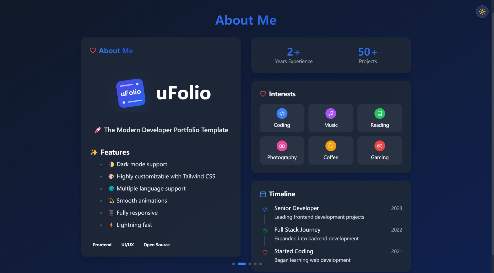

<div align="center">   
<p align="center" style="font-family: 'Segoe UI', Helvetica, Arial, sans-serif; font-weight: 600;">  
  <a href="../README.md">English</a> |  
  <a href="../docs/README_zh-CN.md">简体中文</a>  
</p>  
<div style="display: flex; align-items: center; justify-content: center; gap: 15px;">  
    
  <h1 style="font-family: 'SF Pro Display', -apple-system, BlinkMacSystemFont, 'Segoe UI', Roboto, Oxygen, Ubuntu, Cantarell, 'Open Sans', 'Helvetica Neue', sans-serif; margin: 0; font-size: 3.5rem; font-weight: 700;">  
    uFolio  
  </h1>  
</div>

  <p align="center" style="font-family: 'SF Pro Text', -apple-system, BlinkMacSystemFont, 'Segoe UI', Roboto, Oxygen, Ubuntu, Cantarell, 'Open Sans', 'Helvetica Neue', sans-serif;">  
    <span style="font-size: 1.2rem; font-weight: 600;">🚀 The Modern Developer Portfolio Template</span>
    <br/>
    <span style="color: #666; font-size: 0.9rem; font-style: italic;">Craft your professional identity with style and elegance</span>  
  </p>  

  <div align="center">  
    <a href="https://creativecommons.org/licenses/by-nc-sa/4.0/">
      
    </a>
    <a href="https://reactjs.org/">  
        
    </a> 
    <a href="https://tailwindcss.com/">  
        
    </a>
  </div>  
  <br/>  
</div>

## ✨ 特性

- 🌓 无缝的明暗主题切换
- 🎨 丰富的自定义选项
- 🌍 完整的国际化支持
- 💫 流畅的 Framer Motion 动画
- 📱 全设备响应式设计

## 🖥 效果预览

<div align="center">
  
  
</div>

## 🚀 快速开始

```bash
# 克隆仓库
git clone https://github.com/uarix/uFolio.git

# 进入项目目录
cd uFolio

# 安装依赖
npm i

# 启动开发服务器
npm run dev
```

## 🛠 开发环境配置

### 系统要求

- Node.js (v14 或更高版本)
- npm (v6 或更高版本)
- Git

### 配置说明

自定义你的网站：
- 在 `/src/configs/` 目录下修改常规设置
- 在对应目录下调整 i18n 文件进行本地化

## 🤝 参与贡献

我们欢迎各种形式的贡献！以下是参与方式：

1. **报告问题**：使用我们的问题模板报告bug或提出功能建议
2. **提交更改**：
   - Fork 本仓库
   - 创建特性分支
   - 提交你的更改
   - 更新 [CHANGELOG.md](../CHANGELOG.md)
   - 推送到你的 Fork
   - 提交拉取请求

**注意：** 在提交拉取请求前，请确保合并最新的上游更改！

## 📝 许可证

本项目采用 CC BY-NC-SA 4.0 许可证。详情请查看 [LICENSE](LICENSE) 文件。

### 主要许可条款：
- ✅ 允许复制和修改
- ❗ 必须提供署名
- ❌ 禁止商业使用
- 🔄 衍生作品必须采用相同许可证

## 📊 项目状态

- [x] Beta 版本

---
<div align="center">
  <sub style="font-family: 'SF Pro Text', -apple-system, BlinkMacSystemFont, 'Segoe UI', Roboto, Oxygen, Ubuntu, Cantarell, 'Open Sans', 'Helvetica Neue', sans-serif;">Built with ❤️ by Quarix</sub>
</div>
